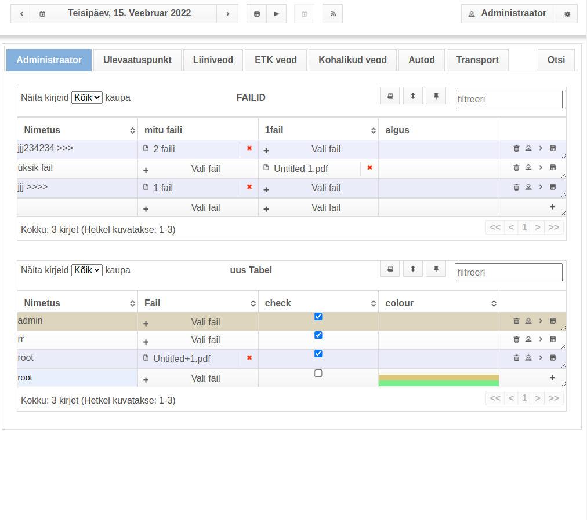
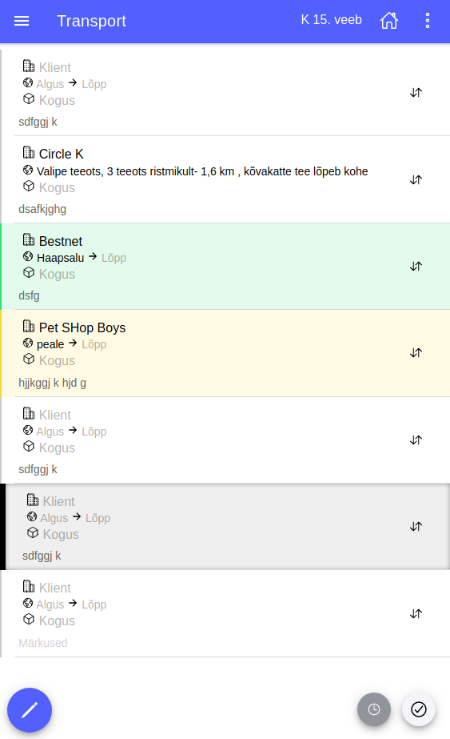

# Kalenderplaan2

> __NB!__ This repository describes a project with closed source code

Fullly customizable datatables with web and android app

## Features
* Real-time updates (SSE)
* File management
* Detailed permissions customization
* Visual table structure builder
* Different table types: default, static, reservations (with public interface for clients to reserve vacant times)
* Different field types: texxt, text (multi line), date, time, float, int, user filter etc

## Screenshots

 

 
